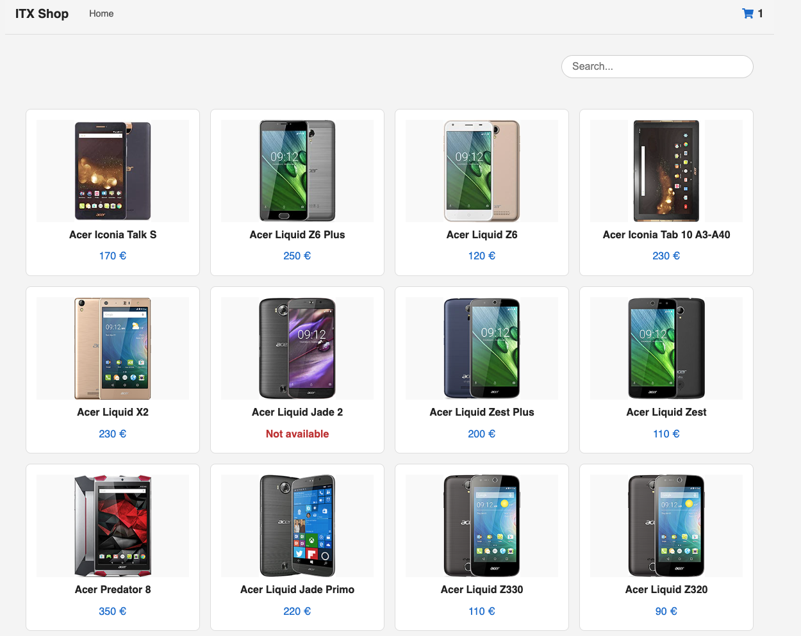

# ITX Shop — React Frontend Technical Challenge

This is a single-page application built with **React**.

The application consists of two views:

- Main Product Listing View
- Product Details View

---

## Tech Stack

- **React 19** with Vite
- **React Router v7**
- **Axios** for API requests
- **CSS Modules** for scoped styling
- **React Context + useReducer** for cart state
- **Custom Hook (`useCache`)** for client-side caching
- **Vitest + React Testing Library** for testing
- **React Toastify** for notifications
- **ESLint + Prettier** for code quality
- **Responsive design**

---

## Setup

```bash
# Install dependencies
npm install

# Start development server
npm run dev

# Run tests
npm run test

# Build for production
npm run build

# Preview production build
npm run preview
```

---

## Architecture & Key Decisions

### State Management

- Global cart state handled with **Context + useReducer**
- Exposes clear actions: `addToCart`, `setCount`, ...

### Routing

- Routes and dynamic params using **react-router-dom**
- Includes **breadcrumbs**

### Caching

- `useCache` custom hook caches API responses in **localStorage** with a valid time of 1 hour
- Prevents redundant API calls and improves performance

### API Layer

- Centralized `axios` instance for all network requests
- Uses `withCredentials: true` to maintain cart session via **cookies**
- Local **proxy setup** avoids CORS issues in development and preview environments

---

## CORS & Session Handling

The API that provides the cart item count **apparently relies on cookies to maintain session state**.  
For this reason, `axios` is configured with `withCredentials: true`.

To avoid CORS issues in development and preview environments, a **local proxy** is defined in `vite.config.js`, which redirects all `/api` requests to:

---

## Screenshots

### Home / Product List



### Product Details Page


### Toast Notification on Add to Cart


---

## Author

**José Ángel Hernández**  
Fullstack Developer  
GitHub: [@joseanher81](https://github.com/yourusername)
